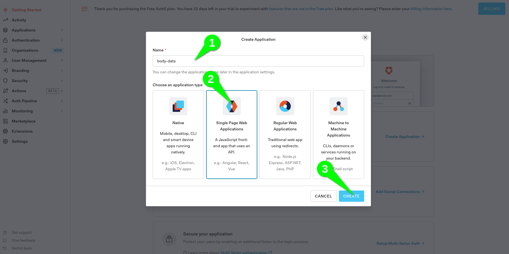

# AUTH0

integrazione autenticazione/oauth0

## prerequisiti

- prima di cominciare con la procedura, committare tutto, in modo da poter revertare in caso di errori.

## procedura

- registrarsi al sito https://auth0.com/
- creare una nuova configuraizone per l'applicazione seguendo i passaggi riportati nelle immagini





eseguirre da terminale:
```
npm install @auth0/auth0-angular
npm install --save express-jwt jwks-rsa express-jwt-authz
```

-iserire in app.module.ts imports:

```
AuthModule.forRoot({
domain: 'bodydata.eu.auth0.com',
clientId: 'lCN6OO71OXxgt9Rz2dC5BakIwK9mmfL3',
redirectUri: window.location.origin,
// The AuthHttpInterceptor configuration
httpInterceptor: {
allowedList: [
'/api',
'/api/*',
],
},
}),
```

-sostituire il contenuto di server.js con:

```
const express = require('express');
const jsonServer = require('json-server');
const server = jsonServer.create();
const path = require('path');
const router = jsonServer.router(path.join(__dirname, 'db.json'));
const middlewares = jsonServer.defaults();
const cors = require('cors');
const jwt = require('express-jwt');
const jwksRsa = require('jwks-rsa');

const authConfig = {
  domain: '',
  audience: '',
  appUri: '',
};

if (!authConfig.domain || !authConfig.audience) {
  throw 'Please make sure that auth_config.json is in place and populated';
}

const checkJwt = jwt({
  secret: jwksRsa.expressJwtSecret({
    cache: true,
    rateLimit: true,
    jwksRequestsPerMinute: 5,
    jwksUri: `https://${authConfig.domain}/.well-known/jwks.json`,
  }),

  audience: authConfig.audience,
  issuer: `https://${authConfig.domain}/`,
  algorithms: ['RS256'],
});


const api = '/api/v1';
// Serve static files....
server.use(express.static(__dirname + '/dist/body-data'));

server.use('/api/v2', checkJwt);
server.use(api, middlewares);
server.use(api, router);

server.get('**', function (req, res) {
  res.sendFile(path.join(__dirname + '/dist/body-data/index.html'));
});

router.render = (req, res) => {
  res.jsonp({
    data: res.locals.data
  })
};

server.listen(process.env.PORT || 3000, (res) => {
  console.log('JSON Server is running on: http://localhost:3000');
});

```

sostituire i parametri (domain,audience,clientId) con quelli che abbiamo generato su https://manage.auth0.com/dashboard

-inserire contenuto cartella auth-store.zip in root-store.

a questo punto la nostra autenticazione funzionerà correttamente
